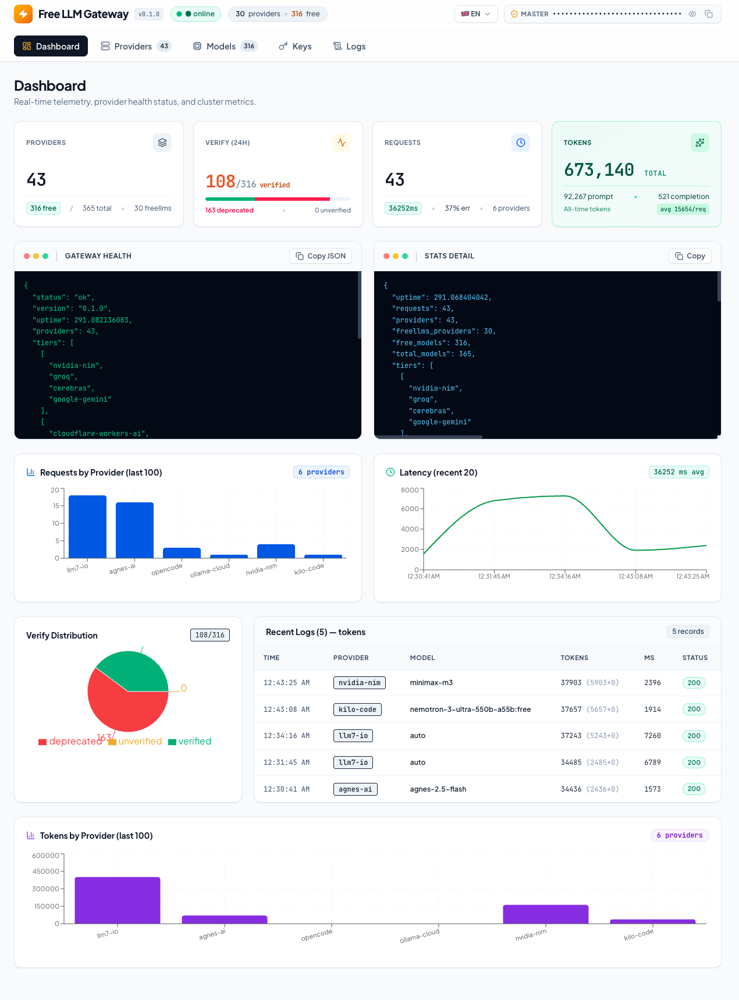
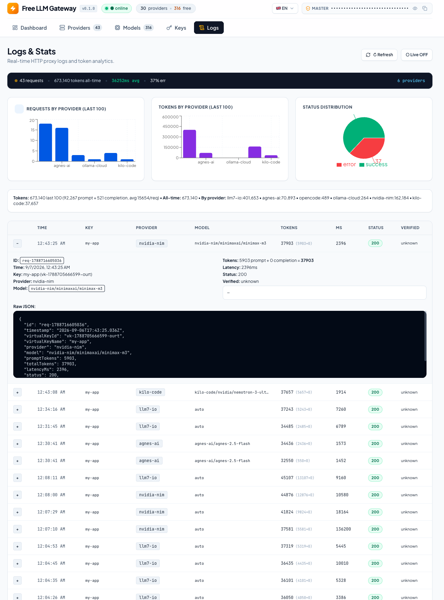

# app-auto-llm-free

> **One endpoint for all free LLMs.** Self-hosted, OpenAI-compatible gateway aggregating all free providers & models into a single endpoint.

[](LICENSE)
[](https://hono.dev)
[](docs/en/API.md)
[](docs/en/PROVIDERS.md)
[](models.yaml)
[](docs/en/FREELLMS_FREE_TIER.md)

> ### 🆓 **100% FREE — No Credit Card • No Trial • Forever**
> **51 Providers • 338 Models (316 freellms free + 8 aliases) • One OpenAI-Compatible Endpoint** — Self-hosted, BYOK, costs you `$0`.
>
> | Tier | Providers | Models | No Card |
> |------|-----------|--------|---------|
> | **Permanent Free** | 26 — NVIDIA NIM **97**, ModelScope **43**, Cloudflare **35**, Gemini **15**, OVH **10**, Cohere **10**, OpenRouter **17**, SambaNova, Groq, Cerebras, Z AI, Agnes, Aion, LLM7… | 260+ | ✅ 29/30 |
> | **Quota Free** | 4 — GitHub Models **13**, Mistral **9**, Kilo Code **8**, HuggingFace **4** | 30+ | ✅ |
> | **Scraped / Unlimited** | 3 — Pollinations, LLM7.io, Ollama Cloud | 6 | ✅ |
> | **Custom Free** | 3 — OrcaRouter, FreeAI, Cline | 3 | ✅ |
>
> Smart routing `auto` → best free with fallback + `x-router` pin + 24h live verify. **If it's free out there, it's here.** → `POST /v1/chat/completions` with any OpenAI SDK. Full list: [docs/en/PROVIDERS.md](docs/en/PROVIDERS.md) • live probe: `POST /api/verify`

> #### ⚙️ **Settings & Multi-Client Ready**
>
> **Dashboard Settings** — `/settings` page loads defaults from `.env` via `GET /api/config`, saves to `localStorage`. Live health checks for `EMBEDDING_MODEL`/`EMBEDDING_FALLBACKS` (green/red), toggles for `SEMANTIC_CACHE`/`COMPRESSION`/`COST_ROUTING`.
>
> **Claude Code** — Set `ANTHROPIC_BASE_URL=http://localhost:7373` and `ANTHROPIC_AUTH_TOKEN=fgk-...`, uses `POST /v1/messages` with model `free-llm-gateway/auto` (strict 8 fallback: pollinations, llm7-io, kilo-code, nvidia-nim, agnes-ai, orcarouter, openrouter).
>
> **OpenCode / Cline / OrcaRouter** — Configure via `OPENCODE_API_KEYS`, `CLINE_API_KEYS`, `ORCAROUTER_API_KEYS` environment variables.
>
> **GitHub Copilot / Codex** — Uses `codex` provider at `https://api.openai.com/v1` with `OPENAI_API_KEYS`/`CODEX_API_KEYS`, model `codex/gpt-5`.
>
> **Any OpenAI SDK** — Works with Vercel AI SDK, LangChain, etc. via standard `baseURL` + `apiKey`.

**Languages:** 🇬🇧 [English](README.md) | 🇻🇳 [Tiếng Việt](README.vi.md) | [Docs Index](docs/README.md) — Docs: [🇬🇧 EN](docs/en/GETTING_STARTED.md) | [🇻🇳 VI](docs/vi/GETTING_STARTED.md)

---

## 📸 Screenshots — Live Dashboard (30 freellms + 2 • 338 free verified 24h)

| Providers — 51 IDs, tier, live health, `Get Key ↗` | Models — 338 (316 freellms + 14 KiraAI + 8 B.AI/TokenHarbor), live probe `Check Live`, `Hide 404` |
|:---:|:---:|
|  |  |

| Dashboard — 4 cards + tokens overview | Logs — request log + SSE stream (charts moved to Usage) |
|:---:|:---:|
|  |  |

---

## ✨ Features

| Category | Features |
|----------|----------|
| **Unified OpenAI-Compatible API** | `POST /v1/chat/completions` (stream + non-stream), `/v1/models`, `/v1/embeddings`, `/v1/images/generations`, `/v1/audio/*`, `/v1/responses`, `/v1/conversations`, `/v1/messages` (Anthropic) — drop-in for OpenAI SDK, Vercel AI, LangChain |
| **51 Free Providers (338 Models)** | **Permanent Free (28)**: NVIDIA NIM (81+), ModelScope (43), Cloudflare (35), Gemini (15), OVH (10), Cohere (10), OpenRouter (17), SambaNova, SiliconFlow, Groq, Cerebras, Z AI, Agnes, Aion, LLM7, Chutes, Glhf, **B.AI (4, 0 Credits)**, **TokenHarbor (3 :free + 1 reserved)**…<br>**Quota Free (4)**: GitHub Models (13), Mistral (9), Kilo Code (8), HuggingFace (4)<br>**Scraped/Unlimited (3)**: Pollinations, LLM7.io, Ollama Cloud<br>**Custom Free (3)**: OrcaRouter, FreeAI, Cline |
| **Smart Routing & Fallback** | Tiered fallback (real key → public free), model aliases (`auto`, `gpt-4`, `glm`, `qwen`, `code` → best free), header `x-router` pin, skips `deprecated`/`quota`/`breaker`, `hasKey` filter |
| **Resilience v2 (0.9.0)** | Shared `tryProviders` executor (6 routes), Redis Lua sliding-window quota/rate-limit (no boundary spikes), circuit breaker 5/30s half-open (5xx/429/exceptions only), TPM/RPM quotas (NVIDIA 40, Groq 30), mid-stream SSE, token pre-flight, persisted 404 strikethrough |
| **Secure Key Management** | AES-256-GCM at-rest, BYOK, virtual keys `fgk-...` (scopes, RPM limits), `fgk-master-...` admin, key rotation script |
| **Dashboard (6 Pages)** | **Dashboard**: 4 stat cards + token overview (charts moved to Usage)<br>**Providers**: pagination 25/50, sticky header, `hasKey` filter (default OFF), `Sync Live Now` + **auto boot-sync** (new provider → `★ NEW` violet + `addedAt`), `Get Key ↗`, live health, **fetch once on reload**<br>**Models**: pagination 25/50, Filters dropdown (`hasKey` OFF, `Hide 404`/`credits`/`invalid` ON), `Check Live (n)`, `Sync Live Now` + **auto sync** (1 lần khi reload), `Refresh`, `Used/Limit`, persisted strikethrough via `POST /api/models/health/mark`<br>**Keys**: `fgk-...` CRUD + Generator + Quick Test<br>**Usage**: Provider topology (App centre + green/violet animated line), **auto highlight newest provider** (`newestProviders` + `lastAdded`) tím, tokens/requests by provider, status pie, SSE live, fetch-all pagination, **fetch once on reload**<br>**Logs**: request table + SSE stream (AbortController safe) |
| **Vector 1+2 (2026-09-08)** | **Audio**: `POST /v1/audio/transcriptions|translations|speech` (Groq/Cerebras/OpenAI, multipart)<br>**Responses**: `POST /v1/responses` + `/v1/conversations` (Hebo, Open Responses API)<br>**Anthropic**: `POST /v1/messages` (Anthropic ↔ OpenAI, streaming, `tool_use` ↔ `tool_calls` preserved)<br>**Semantic Cache**: `SEMANTIC_CACHE_ENABLED=0`, threshold 0.92, TTL 3600s, Cohere embeddings, cosine similarity, Redis/in-memory, parallel embedding fallbacks<br>**Compression**: `COMPRESSION_ENABLED=0`, query-aware `relevanceKeep` (BM25-lite), tools minify, normalized code dedup<br>**Cost Routing**: `COST_ROUTING_ENABLED=0`, score = cost×5 + latency×0.0005 − headroom×0.3 − success×2, `SUCCESS_WEIGHT=2`<br>**Analytics**: `ANALYTICS_RETENTION_DAYS=30`, `costByProvider`, `cacheHitRate`, `p95`, `errorsByProvider`, `GET /api/analytics/*` |
| **Observability** | Pino pretty logs, OpenTelemetry GenAI (`gen_ai.*`), token estimator, request log (1000 entries + `X-Verified`), provider benchmark `PROVIDER_TEST_RESULTS` |

## 🏗️ Architecture

```
Client (OpenAI SDK / Vercel AI SDK) 
  → Hono Gateway (Node/Cloudflare Workers)
    → Middleware: auth, rate-limit, body-limit, logger
    → Smart Router (model → provider pool, sanitize spaces/colon)
    → Provider Adapters (OpenAI/Gemini/Anthropic/Scraped) + format-translator
    → Fallback + Retry + Circuit Breaker + persisted 404 skip
    → Normalizer → OpenAI SSE/JSON
  → Dashboard (Vite + React, i18n VI/EN) → /api/* → Drizzle ORM → SQLite/Postgres + Redis
```

**Request Pipeline (Vector 2) — `apps/gateway/src/routes/v1/chat.ts:105`:**
```
Client Request
  ↓
[Cost Routing?] — config.ts:163 COST_ROUTING_ENABLED=1 → lib/cost-router.ts:99 rankProvidersByCostAndLatency (FREELLMS_COST $/1M + latency EMA data/provider-stats.json + quota headroom)
  ↓
[Semantic Cache?] — config.ts:158 SEMANTIC_CACHE_ENABLED=1 && !stream → lib/semantic-cache.ts:29 get(semantic:${model}:${sha256}) → hit → return cache (200, X-Cache: HIT) + addLog cacheHit
  ↓
[Token Compression?] — config.ts:162 COMPRESSION_ENABLED=1 → lib/compression.ts:103 compressMessages (toolsMinify/historySummarize/codeDedup, ratio <0.95) → messagesToSend
  ↓
Send to Upstream (Anthropic/OpenAI/Gemini...) → Fallback tiered + Circuit Breaker isOpen + checkQuota RPM/TPM/RPD/TPD
  ↓
Store result in cache (lib/semantic-cache.ts:58 set EX CACHE_TTL_S) + record analytics (request-log.ts:7 cost/cacheHit/compressedTokens, lib/analytics.ts:53)
  ↓
Return to Client (OpenAI SSE/JSON + X-Provider/X-Verified + logGenAI otel.ts:10)
```
> Flow: `Cost Routing → Semantic Cache → Compression → Upstream → Cache store + Analytics`. Code reorders `chat.ts:114` to check cache before compression (compress only on cache miss to save compute). Toggle via `Settings` `/settings` (localStorage `gatewaySettings`, defaults from `.env` `GET /api/config`).

See [docs/en/ARCHITECTURE.md](docs/en/ARCHITECTURE.md)

## 🚀 Quick Start — new users see **[GETTING_STARTED.md](docs/en/GETTING_STARTED.md) 5 min** (from 0 to first API call)

### Requirements
- Node >= 22 (`node -v`) + npm >= 10 (`npm -v`)
- Docker (recommended) or Redis + Postgres/SQLite

### 1. Clone & install

```bash
git clone https://github.com/nbhson/app-auto-llm-free.git
cd app-auto-llm-free
cp .env.example .env
# No need to edit MASTER_KEY/ENCRYPTION_KEY — auto-generated on first boot and persisted to .env (or data/.gateway-keys.json)
# Provider keys (GROQ_API_KEYS...) can be empty — still runs via pollinations
# Check generated key: docker compose logs gateway | grep MASTER_KEY  or  cat .env | grep MASTER_KEY
```

### 2. Run with Docker (recommended)

```bash
docker compose up -d
# Gateway: http://localhost:7373
# Dashboard: http://localhost:3000
# Docs: http://localhost:7373/docs
```

### 3. Run dev locally

```bash
npm install
npm run dev:gateway   # Hono @ http://localhost:7373
npm run dev:web       # Vite @ http://localhost:5173
```

> **⚠️ After updating `.env` you must kill the old gateway and restart** — gateway reads `.env` only at boot (`config.ts:22`), `tsx watch` does **not** watch `.env`. Sau khi restart, **auto boot-sync** (`jobs/boot-sync.ts`) tự phát hiện provider mới (qua `data/.provider-fingerprint.json` `hasKey` → `true`), tự chạy `syncLiveModels` + `verify` và 3 trang **Providers / Models / Usage** tự poll cập nhật — không cần bấm `Sync Live`. Xem **Kill old process → restart** bên dưới.

#### 🔄 Kill old process & restart after `.env` change

**Docker (any OS):**
```bash
docker compose restart gateway
```

**macOS / Linux (npm):**
```bash
# kill tsx watch + any process on 7373, then restart
pkill -f "tsx watch"
lsof -ti:7373 | xargs kill -9
sleep 2
lsof -i :7373          # should be empty
npm run dev:gateway
```

**Windows (PowerShell — run as Administrator if needed):**
```powershell
# Find PID using port 7373 then kill it
netstat -ano | findstr :7373
taskkill /PID <PID> /F
# or kill all Node processes (closes all npm dev servers)
taskkill /F /IM node.exe

# alternative PowerShell one-liner
Stop-Process -Id (Get-NetTCPConnection -LocalPort 7373).OwningProcess -Force -ErrorAction SilentlyContinue
npm run dev:gateway
```

**Windows (Git Bash / CMD):**
```cmd
netstat -ano | findstr :7373
taskkill /PID <PID> /F
npm run dev:gateway
```

### 4. Call API (OpenAI SDK)

```ts
import OpenAI from "openai";

const client = new OpenAI({
  baseURL: "http://localhost:7373/v1",
  apiKey: "fgk-master-xxx", // auto-generated MASTER_KEY from .env/logs — also works for /v1/* single-key usage
  // or create scoped fgk-... in Dashboard /keys for per-app keys
});

const res = await client.chat.completions.create({
  model: "auto", // or "gpt-4", "gemini-3.6-flash", "llama-3.3-70b"
  messages: [{ role: "user", content: "Hello free gateway!" }],
  stream: false,
});
console.log(res.choices[0].message.content);

// Streaming
const stream = await client.chat.completions.create({
  model: "auto",
  messages: [{ role: "user", content: "Write a poem" }],
  stream: true,
});
for await (const chunk of stream) {
  process.stdout.write(chunk.choices[0]?.delta?.content || "");
}
```

Or `curl`:

```bash
curl http://localhost:7373/v1/chat/completions \
  -H "Authorization: Bearer fgk-xxx" \
  -H "Content-Type: application/json" \
  -d '{"model":"auto","messages":[{"role":"user","content":"Hello"}],"stream":false}'

# Models: filter by provider / verified tier (live, not freellms)
curl "http://localhost:7373/v1/models?hasKey=1&limit=25" -H "Authorization: Bearer fgk-xxx"
curl "http://localhost:7373/api/models/live/sync" -X POST -H "Authorization: Bearer fgk-master-xxx"
```

## ⚙️ Configuration

See [.env.example](.env.example) and [docs/en/CONFIGURATION.md](docs/en/CONFIGURATION.md). Live sync see [docs/en/OPERATIONS.md](docs/en/OPERATIONS.md).

```env
PORT=7373
DATABASE_URL=file:./data.db          # or postgres://...
REDIS_URL=redis://localhost:6379
# MASTER_KEY / ENCRYPTION_KEY are optional — auto-generated on first boot if missing/placeholder
# MASTER_KEY=fgk-master-xxx   # single API key for /v1/* + /api/* (check logs or .env after first start)
# ENCRYPTION_KEY=64hex...      # internal AES-256-GCM, never exposed as API key
SYNC_INTERVAL_MS=86400000            # 24h verify live
DISABLE_SCHEDULER=0

# Provider keys (pool, comma-separated, live source)
GROQ_API_KEYS=gsk_xxx,gsk_yyy
GEMINI_API_KEYS=AIza_xxx,AIza_yyy
CEREBRAS_API_KEYS=csk_xxx
NVIDIA_API_KEYS=nvapi-xxx
# ... 30 providers, see .env.example
```

Create scoped virtual key (optional — MASTER_KEY already works for /v1/*):

```bash
curl -X POST http://localhost:7373/api/keys \
  -H "Authorization: Bearer fgk-master-xxx" \
  -H "Content-Type: application/json" \
  -d '{"name":"my-app","scopes":{"models":["*"],"providers":["*"]},"rpmLimit":60}'
# Or just use MASTER_KEY directly for single-key usage: Authorization: Bearer fgk-master-xxx
```

## 📚 Documentation

| Document | Description |
|----------|-------|
| [GETTING_STARTED.md](docs/en/GETTING_STARTED.md) | **For newcomers — 5 min** from 0 to first API call, Dashboard, common errors |
| [ARCHITECTURE.md](docs/en/ARCHITECTURE.md) | Architecture, request flow, provider interface |
| [PROVIDERS.md](docs/en/PROVIDERS.md) | List of **41 providers**, free tier limits, base URLs, how to add provider |
| [FREELLMS_FREE_TIER.md](docs/en/FREELLMS_FREE_TIER.md) | Freellms.org snapshot (historical) — live is now source of truth |
| [OPERATIONS.md](docs/en/OPERATIONS.md) | Operations & live verify (hasKey, Sync Live Now, persisted 404) |
| [API.md](docs/en/API.md) | OpenAI-compatible endpoints, aliases, streaming, error codes, pagination 25/50 |
| [CONFIGURATION.md](docs/en/CONFIGURATION.md) | Environment variables, models.yaml, rate limit |
| [DEPLOYMENT.md](docs/en/DEPLOYMENT.md) | Docker, Cloudflare Workers, Vercel, bare metal |
| [PRODUCTION.md](docs/en/PRODUCTION.md) | Production guide — Postgres migration, monitoring, alerting, backup, scaling |
| [ROADMAP.md](docs/en/ROADMAP.md) | Roadmap P1→P5, milestones |
| [CONTRIBUTING.md](CONTRIBUTING.md) | Contribution guide |

## 🗺️ Roadmap

- [x] **P1 Scaffold** — Hono + Vite + Drizzle + Docker (51 ids, live models, pagination 25/50)
- [x] **Freellms Sync** — Historical snapshot (now disabled, live is source)
- [x] **P2 Gateway Core** ✅ Done — 30 adapters, streaming SSE, `auto` 15-tier, `x-router` pin, sanitize spaces
- [x] **P3 Resilience** ✅ Done — key-manager AES-GCM, quota RPM/TPM, breaker 5/30s, health 41, persisted 404 strikethrough + disable
- [x] **P7 Resilience v2 (0.9.0)** ✅ Done 2026-09-09 — shared `tryProviders` executor, Redis sliding-window quota/rate-limit, query-aware compression, cost routing by success-rate, tool_use preserved, 232 tests
- [x] **P4 Auth + Dashboard** ✅ Done — `fgk-...` CRUD, rate-limit, request-log SSE, Dashboard 6 routes with hasKey + Hide 404 + Sync Live
- [x] **P5 Hardening** ✅ Done — `wrangler.jsonc`, Dockerfile prod, OTel, i18n VI/EN (UI + docs/vi docs/en)
- [x] **P6 Vector 1+2** ✅ Done 2026-09-08 — `/v1/audio/*` (transcriptions/translations/speech) + `/responses`/`/conversations` (Hebo) + `/v1/messages` (Anthropic) + semantic cache (`SEMANTIC_CACHE_ENABLED`/`SEMANTIC_THRESHOLD=0.92`/`CACHE_TTL_S=3600`/`cohere/embed-english-v3.0`) + compression (`COMPRESSION_ENABLED`) + cost routing (`COST_ROUTING_ENABLED`) + analytics (`costByProvider`/`cacheHitRate`/`p95`, `ANALYTICS_RETENTION_DAYS=30`)

See [docs/en/ROADMAP.md](docs/en/ROADMAP.md).

## 🤝 Contributing

PRs welcome! See [CONTRIBUTING.md](CONTRIBUTING.md). Please run `npm run lint` + `npm test` before push. Requires Node >= 22.

## 📜 License

Apache-2.0 — see [LICENSE](LICENSE).

---
