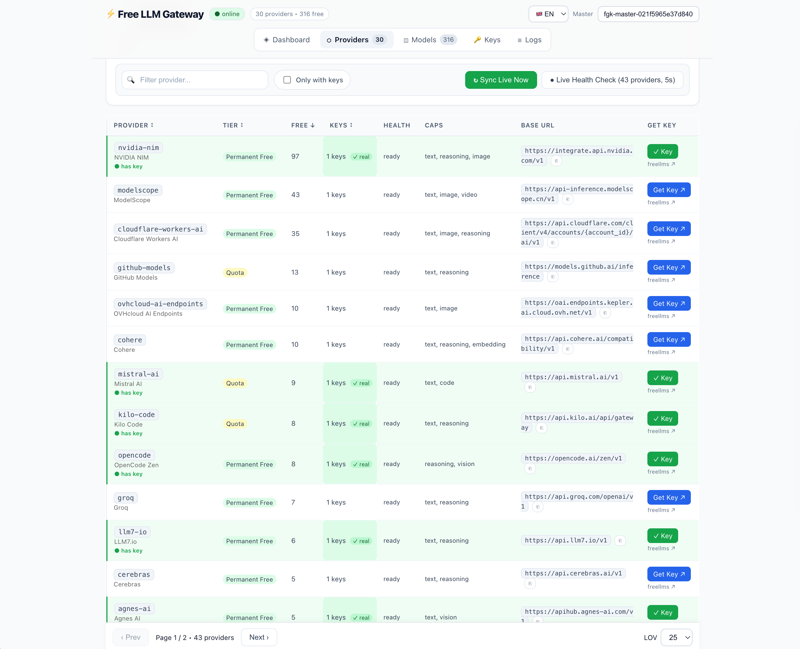
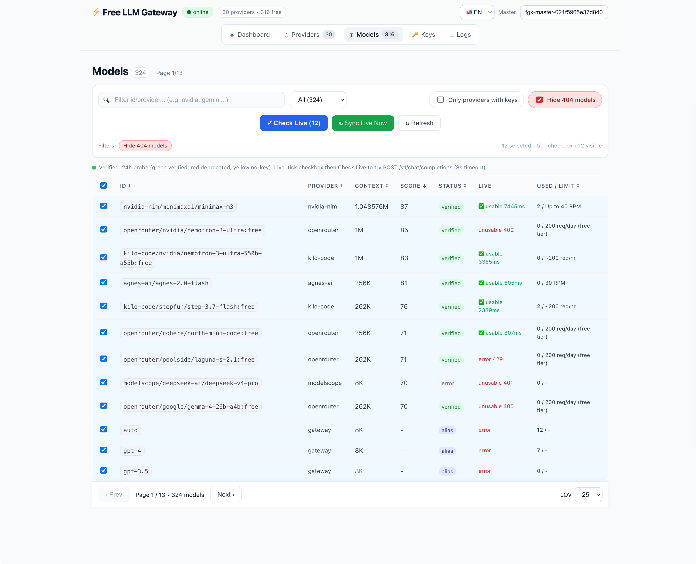

# app-auto-llm-free

> **Một endpoint duy nhất cho mọi LLM miễn phí.** Tương tự OmniRoute / 9Router / FreeLLMAPI — tự host, OpenAI-compatible, gom toàn bộ provider & model free vào một gateway.

[](LICENSE)
[](https://hono.dev)
[](docs/vi/API.md)
[](docs/vi/PROVIDERS.md)
[](models.yaml)
[](docs/vi/FREELLMS_FREE_TIER.md)

> ### 🆓 **100% MIỄN PHÍ — Không Cần Thẻ • Không Trial • Mãi Mãi**
> **43 Provider • 324 Model (316 free freellms + 8 alias) • Một Endpoint OpenAI-Compatible** — Tự host, BYOK, chi phí `$0`.
>
> | Nhóm | Provider | Model | Không cần thẻ |
> |------|----------|-------|--------------|
> | **Permanent Free (vĩnh viễn)** | 26 — NVIDIA NIM **97**, ModelScope **43**, Cloudflare **35**, Gemini **15**, OVH **10**, Cohere **10**, OpenRouter **17**, SambaNova, Groq, Cerebras, Z AI, Agnes, Aion, LLM7… | 260+ | ✅ 29/30 |
> | **Quota Free** | 4 — GitHub Models **13**, Mistral **9**, Kilo Code **8**, HuggingFace **4** | 30+ | ✅ |
> | **Scraped / Unlimited** | 3 — Pollinations, LLM7.io, Ollama Cloud | 6 | ✅ |
> | **Custom Free** | 3 — OrcaRouter, FreeAI, Cline | 3 | ✅ |
>
> Smart routing `auto` → model free tốt nhất + fallback + `x-router` pin + verify live 24h. **Cứ free ngoài kia là có ở đây.** → `POST /v1/chat/completions` với mọi OpenAI SDK. Full list: [docs/vi/PROVIDERS.md](docs/vi/PROVIDERS.md) • live probe: `POST /api/verify`

**Languages / Ngôn ngữ:** 🇻🇳 [Tiếng Việt](docs/vi/GETTING_STARTED.md) | 🇬🇧 [English](docs/en/GETTING_STARTED.md) | [Docs Index](docs/README.md)

---

## 📸 Screenshots — Dashboard Live (30 provider • 316 free verify 24h)

| Providers — 43 IDs, tier, live health, `Get Key ↗` | Models — 324 (316 free + 8 alias), live probe `Check Live`, `Hide 404` |
|:---:|:---:|
|  |  |

> **Dashboard** 5 routes `Dashboard → Providers → Models → Keys → Logs` — Pagination 25/50 sticky, `hasKey` filter, `Sync Live Now` probe 24h, `Check Live (8s)` per-model, `Only with keys`, `Hide 404` persist strikethrough.

---

## ✨ Tính năng

| Nhóm | Chi tiết |
|------|----------|
| **Unified Endpoint** | `POST /v1/chat/completions` (stream + non-stream), `/v1/models`, `/v1/embeddings`, `/v1/images/generations` — dùng trực tiếp với OpenAI SDK |
| **Provider Hybrid (30)** | **Permanent Free**: NVIDIA NIM (97), ModelScope (43), Cloudflare (35), Gemini (15), OVH (10), Cohere (10), SambaNova, SiliconFlow, Groq (7), Cerebras (5), Z AI, Agnes, Aion, LLM7, Chutes, Glhf… <br> **Quota**: GitHub Models (13), Mistral (9), Kilo Code (8), HuggingFace (4) <br> **Scraped**: Pollinations, LLM7.io, Ollama Cloud (3 free) — Nguồn: freellms.org (316 free models) |
| **Smart Routing** | Tiered 15 (real key → public free), alias (`auto`/`gpt-4`/`glm`/`qwen`/`code` → best free), header `x-router`, skip `deprecated`/`quota`/`breaker` |
| **Resilience** | Auto fallback 15 providers, circuit breaker 5/30s half-open, TPM/RPM quota (NVIDIA 40, Groq 30), mid-stream SSE, token pre-flight |
| **Key Pool** | AES-256-GCM at-rest, BYOK, virtual keys `fgk-...` (scopes, RPM), `fgk-master-...` admin, `rotate-keys.ts` |
| **Dashboard (5 routes)** | Nav `Dashboard → Providers → Models → Keys → Logs` (sticky, `providers` trước `models`), **Dashboard** 4 cards + 3 charts (byProvider/latency/verify) + tokens, **Providers** `Get Key ↗` + live health, **Models** 316 checkbox + `Check Live` + `Used/Limit`, **Keys** `fgk-...` CRUD + Key Generator (thay openssl) + Quick Test, **Logs** charts + SSE |
| **Observability** | Pino pretty, OTel GenAI (`gen_ai.*`), token estimator, `request-log` 1000 + `X-Verified`, `PROVIDER_TEST_RESULTS` benchmark |

## 🏗️ Kiến trúc

```
Client (OpenAI SDK / Vercel AI SDK) 
  → Hono Gateway (Bun/Node/Cloudflare Workers)
    → Middleware: auth, rate-limit, body-limit, logger
    → Smart Router (model → provider pool)
    → Provider Adapters (OpenAI/Gemini/Anthropic/Scraped) + format-translator
    → Fallback + Retry + Circuit Breaker
    → Normalizer → OpenAI SSE/JSON
  → Dashboard (Vite + React) → /api/* → Drizzle ORM → SQLite/Postgres + Redis
```

Chi tiết xem [docs/ARCHITECTURE.md](docs/ARCHITECTURE.md)

## 🚀 Quick Start — người mới xem **[GETTING_STARTED.md](docs/GETTING_STARTED.md) 5 phút** (từ 0 tới gọi API đầu tiên)

### Yêu cầu
- Bun >= 1.1 hoặc Node >= 20
- Docker (khuyến nghị) hoặc Redis + Postgres/SQLite

### 1. Clone & cài đặt

```bash
git clone https://github.com/nbhson/app-auto-llm-free.git
cd app-auto-llm-free
cp .env.example .env
# Điền MASTER_KEY/ENCRYPTION_KEY: mở http://localhost:3000 → Key Generator (thay openssl) hoặc openssl rand -hex
# Provider keys (GROQ_API_KEYS...) để trống vẫn chạy pollinations
```

### 2. Chạy với Docker (khuyến nghị)

```bash
docker compose up -d
# Gateway: http://localhost:8080
# Dashboard: http://localhost:3000
# Docs: http://localhost:8080/docs
```

### 3. Chạy dev local

```bash
bun install
bun run dev:gateway   # Hono @ http://localhost:8080
bun run dev:web       # Vite @ http://localhost:5173
```

### 4. Gọi API (OpenAI SDK)

```ts
import OpenAI from "openai";

const client = new OpenAI({
  baseURL: "http://localhost:8080/v1",
  apiKey: "fgk-your-virtual-key", // tạo trong Dashboard /api/keys
});

const res = await client.chat.completions.create({
  model: "auto", // hoặc "gpt-4", "gemini-1.5-flash", "llama-3.3-70b"
  messages: [{ role: "user", content: "Hello free gateway!" }],
  stream: false,
});
console.log(res.choices[0].message.content);

// Streaming
const stream = await client.chat.completions.create({
  model: "auto",
  messages: [{ role: "user", content: "Write a poem" }],
  stream: true,
});
for await (const chunk of stream) {
  process.stdout.write(chunk.choices[0]?.delta?.content || "");
}
```

Hoặc `curl`:

```bash
curl http://localhost:8080/v1/chat/completions \
  -H "Authorization: Bearer fgk-xxx" \
  -H "Content-Type: application/json" \
  -d '{"model":"auto","messages":[{"role":"user","content":"Hello"}],"stream":false}'

# Models: lọc theo provider / verified tier thực sự còn free (24h probe)
curl "http://localhost:8080/v1/models?verified=free" -H "Authorization: Bearer fgk-xxx"
curl "http://localhost:8080/v1/models?provider=nvidia-nim&verified=free" -H "Authorization: Bearer fgk-xxx"
curl "http://localhost:8080/api/verify/summary" -H "Authorization: Bearer fgk-master-xxx"
```

## ⚙️ Cấu hình

Xem [.env.example](.env.example) và [docs/CONFIGURATION.md](docs/CONFIGURATION.md). Sync 24h xem [docs/OPERATIONS.md](docs/OPERATIONS.md).

```env
PORT=8080
DATABASE_URL=file:./data.db          # hoặc postgres://...
REDIS_URL=redis://localhost:6379
MASTER_KEY=fgk-master-xxx
ENCRYPTION_KEY=32bytes-hex...
SYNC_INTERVAL_MS=86400000            # 24h verify live
DISABLE_SCHEDULER=0

# Provider keys (pool, phân tách bằng dấu phẩy, 30 providers freellms)
GROQ_API_KEYS=gsk_xxx,gsk_yyy
GEMINI_API_KEYS=AIza_xxx,AIza_yyy
CEREBRAS_API_KEYS=csk_xxx
NVIDIA_API_KEYS=nvapi-xxx
# ... 30 providers, xem .env.example đầy đủ
```

Tạo virtual key:

```bash
curl -X POST http://localhost:8080/api/keys \
  -H "Authorization: Bearer fgk-master-xxx" \
  -H "Content-Type: application/json" \
  -d '{"name":"my-app","scopes":{"models":["*"],"providers":["*"]},"rpmLimit":60}'
```

## 📚 Tài liệu

| Tài liệu | Mô tả |
|----------|-------|
| [GETTING_STARTED.md](docs/GETTING_STARTED.md) | **Cho người mới — 5 phút** từ 0 tới gọi API đầu tiên, Dashboard, lỗi thường gặp |
| [ARCHITECTURE.md](docs/ARCHITECTURE.md) | Chi tiết kiến trúc, luồng request, provider interface |
| [PROVIDERS.md](docs/PROVIDERS.md) | Danh sách **30 providers (freellms)**, free tier limits, base URLs, cách thêm provider |
| [FREELLMS_FREE_TIER.md](docs/FREELLMS_FREE_TIER.md) | Scan freellms.org 2026-09-06 — 316 free models, ranking, rate limits |
| [OPERATIONS.md](docs/OPERATIONS.md) | Vận hành & xác thực free tier 24h (live verify vs freellms, scheduler, cron) |
| [API.md](docs/API.md) | Đặc tả OpenAI-compatible endpoints, alias, streaming, error codes |
| [CONFIGURATION.md](docs/CONFIGURATION.md) | Biến môi trường (30 providers), models.yaml, rate limit |
| [DEPLOYMENT.md](docs/DEPLOYMENT.md) | Docker, Cloudflare Workers, Vercel, bare metal |
| [ROADMAP.md](docs/ROADMAP.md) | Lộ trình P1→P5, milestones |
| [CONTRIBUTING.md](CONTRIBUTING.md) | Quy trình đóng góp |

## 🗺️ Roadmap

- [x] **P1 Scaffold** — Hono + Vite + Drizzle + Docker (30 providers, 316 models registry)
- [x] **Freellms Sync** — Scan freellms.org, `data/*.json` + `models.yaml` (316 free) + `scripts/sync-freellms.py`
- [x] **P2 Gateway Core** ✅ Done 2026-09-06 — 30 adapters, streaming SSE (Gemini `alt=sse` → OpenAI), tool calling, `auto` 15-tier → pollinations live, `x-router` pin
- [x] **P3 Resilience** ✅ Done 2026-09-06 — key-manager AES-GCM, quota RPM/TPM (NVIDIA 40/Groq 30/Cerebras 15/1M), breaker 5/30s, `GET /api/providers/health` live 40, `X-Verified` + deprecated skip
- [x] **P4 Auth + Dashboard** ✅ Done 2026-09-06 — `fgk-...` CRUD (hash SHA256, scopes, RPM), `rate-limit` virtual key, `request-log` SSE, Dashboard 5 routes (Dashboard verify, Models badges, Providers health, Keys CRUD, Logs live)
- [x] **P5 Hardening** ✅ Done 2026-09-06 — `wrangler.jsonc` Cloudflare, Dockerfile prod non-root + HEALTHCHECK, `otel.ts` GenAI, `secureHeaders` + `bodyLimit`, `benchmark.ts` + `PROVIDER_TEST_RESULTS.md` (online 13/40, chat 1539ms), `rotate-keys.ts` AES rotation, `SECURITY.md` hardening checklist

Chi tiết [docs/ROADMAP.md](docs/ROADMAP.md).

## 🤝 Đóng góp

PRs welcome! Xem [CONTRIBUTING.md](CONTRIBUTING.md). Vui lòng chạy `bun run lint` + `bun run test` trước khi push.

## 📜 License

Apache-2.0 — xem [LICENSE](LICENSE).

---

**Tham khảo**: [OmniRoute](https://github.com/diegosouzapw/OmniRoute) (271 providers), [9Router](https://github.com/decolua/9router), [Free LLM Gateway](https://github.com/MrFadiAi/free-llm-gateway) (24+ providers), [LiteLLM](https://github.com/BerriAI/litellm), [Hebo Gateway](https://github.com/8monkey-ai/hebo-gateway).
