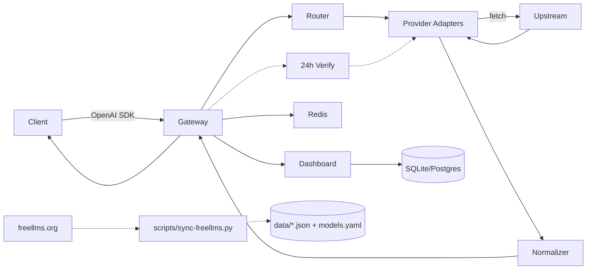

# Kiến trúc (Architecture)

Tài liệu này mô tả kiến trúc chi tiết của `app-auto-llm-free` — gateway thống nhất cho LLM free (30 providers, 316 free models từ freellms.org).

## 1. Tổng quan



* **Gateway**: Hono app chạy trên Bun/Node/Cloudflare Workers (WinterCG). Multi-runtime, ultrafast RegExpRouter.
* **Router**: Chọn provider pool dựa trên `model`, alias (`auto`, `gpt-4`, `glm`, `qwen`, `code`, `embedding`), header `x-router`, tier fallback 4-tier freellms.
* **Adapters**: Mỗi provider implement `Provider` interface. 30 providers freellms (NVIDIA 97, ModelScope 43, Cloudflare 35...) qua `createOpenAICompatibleProvider`, Gemini qua `format-translator`, Pollinations scraped.
* **Dashboard**: Vite + React, gọi `/api/*`, hiển thị usage/logs/health, model catalog 316 với badge `verified_free`/`deprecated`/`unverified_no_key`.
* **Data Layer**: `data/freellms-providers.json` (30), `data/freellms-models-free.json` (316), `models.yaml` (316), `data/verified-models.json` (live verify).
* **Scheduler**: `jobs/scheduler.ts` chạy mỗi 24h (`SYNC_INTERVAL_MS`), so sánh freellms FREE vs live `/models` (xem `docs/OPERATIONS.md`).

Tham khảo: `free-llm-gateway` (24+ providers) và `OmniRoute` (271 providers, 90 free).

## 2. Luồng request

```
1. POST /v1/chat/completions  {model, messages, stream, tools}
2. middleware/auth            -> verify `fgk-...` timing-safe, load scopes
3. middleware/rateLimit       -> Redis rolling window RPM/TPM check
4. token-estimator            -> ước tính TPM pre-flight, reject nếu vượt
5. smart-router               -> resolve alias (auto/gpt-4/glm/qwen) -> provider pool ordered
                               filter deprecated nếu có verified data (verified=free)
6. for provider in pool:
     key = key-manager.getNext(provider)  # round-robin, skip rate-limited
     try: response = provider.chat(req, key) # fetch với proxy helper
     catch 429/timeout: quota-tracker.markRateLimited(key); continue
     catch other: circuit-breaker.recordFail(provider); continue
     success: break
7. normalizer                 -> chuyển Gemini shape về OpenAI shape
8. SSE passthrough            -> if stream: proxy chunk-by-chunk, handle mid-stream error
9. logger + request_db        -> ghi latency, tokens, cost, provider đã dùng
10. return OpenAI JSON/SSE
```

## 3. Provider Interface

`apps/gateway/src/providers/base.ts:1`

```ts
export interface ChatRequest {
  model: string;
  messages: Array<{ role: string; content: string | Part[] }>;
  temperature?: number;
  max_tokens?: number;
  stream?: boolean;
  tools?: Tool[];
  tool_choice?: string | object;
}

export interface Provider {
  id: string; // 'nvidia-nim' | 'groq' | 'google-gemini' | 'pollinations'
  type: 'openai-compatible' | 'gemini' | 'anthropic' | 'scraped';
  chat(req: ChatRequest, apiKey: string): Promise<Response>;
  models(apiKey?: string): Promise<ModelInfo[]>; // GET {baseUrl}/models
  health(apiKey: string): Promise<boolean>;
}
```

* `openai-compatible` (28/30): NVIDIA (`integrate.api.nvidia.com/v1`), Groq (`api.groq.com/openai/v1`), Cerebras, GitHub Models (`models.github.ai/inference`), OVH, Cohere (`/v2`), ModelScope, Chutes, SambaNova, SiliconFlow, Glhf, Mistral, LLM7, Agnes, Aion, Z AI (`open.bigmodel.cn/api/paas/v4`), DeepSeek, OpenRouter, Ollama Cloud, Nscale, Nebius, AI21… — chỉ cần `baseURL + Authorization`.
* `gemini`: Google (`generativelanguage.googleapis.com/v1beta`) — cần `format-translator` (OpenAI → Gemini contents).
* `scraped`: Pollinations (`text.pollinations.ai/openai`) — không cần key, tự map alias `auto` → `openai`.

Registry `apps/gateway/src/providers/registry.ts:1` liệt kê 40 ids (30 freellms slugs + alias `mistral`/`gemini`/`nvidia`), `providerMeta` chứa caps/tier/noCard, alias map 12 keys.

## 4. Router & Fallback

Học `smart_router.py` + OmniRoute 19 strategies, thực tế freellms tier:

| Strategy | Mô tả |
|----------|-------|
| `round-robin` | Mặc định, phân tán tải |
| `tiered` | 4-tier từ `.env.example:19` `FALLBACK_TIERS=[["nvidia-nim","groq","cerebras","google-gemini"],["cloudflare-workers-ai","cohere","sambanova","siliconflow"],["ovhcloud-ai-endpoints","modelscope","llm7-io","hugging-face"],["openrouter","kilo-code","pollinations"]]` |
| `latency` | Chọn p50 thấp nhất (P3) |
| `alias` | `auto`→5 P0, `gpt-4`→5, `claude-3`→4, `glm`→3, `qwen`→4, `code`→4, `embedding`→3 (xem `registry.ts:42`) |
| `verified` | Nếu có `data/verified-models.json`, `GET /v1/models?verified=free` loại `deprecated` khỏi pool |

Fallback: Tiered fallback với circuit breaker (5 fails / 30s cooldown, `config.ts:30`). Mid-stream SSE error → emit `data: {"error": ...}\n\n` rồi close.

## 5. Key Management & Security

* **Encryption at rest**: AES-256-GCM (WebCrypto), key từ `ENCRYPTION_KEY`. `key_encryptor.py` style.
* **Virtual keys**: prefix `fgk-`, hash SHA-256, scopes `{models, providers}`, `rpmLimit`, `tpdLimit`.
* **Key pool**: `GROQ_API_KEYS=gsk_xxx,gsk_yyy` → round-robin, skip `Retry-After`. `config.ts:32` hỗ trợ 30 providers freellms (kể cả `OVHCLOUD_API_KEYS` alias).
* **Auth**: `hono/bearer-auth` + timing-safe compare, `admin`/`user`.

## 6. Rate Limiting & Quota

* **Redis rolling window**: RPM/RPD/TPM/TPD per virtual key + per provider key (freellms limits: NVIDIA 40 RPM shared, Groq 30/14.4K, Cerebras 15/1M TPD, Gemini 15/1.5K, OVH 2 anon, Agnes 30, OpenRouter 200/day, Kilo ~200/hr).
* **Headers**: `x-ratelimit-remaining-*`, `retry-after` khi 429.
* **Token estimator**: `js-tiktoken` pre-flight. `quota-tracker.ts` (P3) sẽ dùng `models.yaml:1` `limit` field.

## 7. Data & Verification

| File | Nguồn | Nội dung |
|------|-------|----------|
| `data/freellms-providers.json` | freellms.org/providers (30) | `name, slug, tier, caps, noCard, free_models` |
| `data/freellms-models-free.json` | freellms.org/models (316 free) | `name, slug, context, score, limit, verified, modality` |
| `models.yaml` | `scripts/sync-freellms.py` | 316 entries, `id: nvidia-nim/z-ai/glm-5.2`, `score`, `limit` |
| `data/verified-models.json` | `jobs/verify-free.ts` live probe | `status: verified_free / deprecated / unverified_no_key / error`, `last_verified` |
| `data/verified-summary.json` | `jobs/verify-free.ts` | Tổng hợp per-provider |

Luồng sync: `scripts/sync-freellms.py` (Layer 1) → `jobs/verify-free.ts` probe `provider.models()` mỗi 24h (Layer 2, scheduler + `POST /api/verify`) → `GET /v1/models?verified=free` chỉ trả `verified_free`. Xem `docs/OPERATIONS.md:1`.

## 8. Database

Drizzle ORM (`apps/gateway/src/db/schema.ts:1`):

```ts
users(id, email, password_hash, role)
virtual_keys(id, prefix, hash, user_id, scopes JSON, rpm_limit, tpd_limit)
provider_keys(id, provider, encrypted_key, status, last_checked_at)
requests(id, virtual_key_id, provider, model, prompt_tokens, completion_tokens, latency, cost, status, created_at)
providers_cache(provider, models JSON, synced_at) // cache verified
```

* SQLite (`better-sqlite3`/`Bun.SQL`) dev, Postgres (`pg`) prod, BRIN index time-ordered.

## 9. Cấu trúc thư mục

```
.
├── apps/gateway/src/
│   ├── index.ts              # serve + startScheduler()
│   ├── app.ts                # Hono + cors + auth + routes
│   ├── config.ts             # 30 providers keys + 4-tier fallback
│   ├── providers/registry.ts # 40 ids, providerMeta, aliases
│   ├── providers/openai-compatible.ts, gemini.ts, pollinations.ts
│   ├── routes/v1/models.ts   # freellms 316 + verified filter
│   ├── routes/v1/chat.ts     # tiered fallback + streaming
│   ├── routes/api.ts         # /providers (detailed), /verify, /stats
│   ├── jobs/verify-free.ts   # live probe 24h
│   ├── jobs/scheduler.ts     # setInterval 86400000
│   └── middleware/logger.ts
├── apps/web/src/             # Vite React Dashboard
├── data/*.json               # freellms + verified
├── models.yaml               # 316 free
├── scripts/sync-freellms.py  # freellms fetcher
└── .github/workflows/sync-freellms.yml # daily 02:00 UTC
```

## 10. Observability & Deploy

* `pino` logger, OTel GenAI (Hebo style).
* `GET /api/stats` — providers 40, free_models 316, uptime; `GET /api/verify/summary` — verified/deprecated.
* Docker Compose (gateway+postgres+redis) primary; Cloudflare Workers secondary (KV). Xem `docs/DEPLOYMENT.md:1`.
