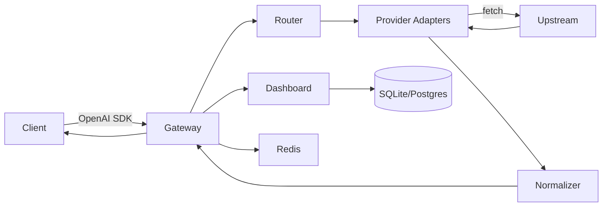

# Kiến trúc (Architecture)

Tài liệu này mô tả kiến trúc chi tiết của `app-auto-llm-free` — gateway thống nhất cho LLM free.

## 1. Tổng quan



* **Gateway**: Hono app chạy trên Bun/Node/Cloudflare Workers (WinterCG). Multi-runtime, ultrafast RegExpRouter.
* **Router**: Chọn provider pool dựa trên `model`, alias, header `x-router`, tier fallback.
* **Adapters**: Mỗi provider implement `Provider` interface. Tự xử lý auth header, body translation, response normalization.
* **Dashboard**: Vite + React, gọi `/api/*`, hiển thị usage/logs/health.

Tham khảo: `free-llm-gateway` (Python) và `OmniRoute` (TS fork 9Router/CLIProxyAPI).

## 2. Luồng request

```
1. POST /v1/chat/completions  {model, messages, stream, tools}
2. middleware/auth            -> verify `fgk-...` timing-safe, load scopes
3. middleware/rateLimit       -> Redis rolling window RPM/TPM check
4. token-estimator            -> ước tính TPM pre-flight, reject nếu vượt
5. smart-router               -> resolve alias (auto/gpt-4) -> provider pool ordered
6. for provider in pool:
     key = key-manager.getNext(provider)  # round-robin, skip rate-limited
     try: response = provider.chat(req, key) # fetch với proxy helper
     catch 429/timeout: quota-tracker.markRateLimited(key); continue
     catch other: circuit-breaker.recordFail(provider); continue
     success: break
7. normalizer                 -> chuyển Gemini/Anthropic shape về OpenAI shape
8. SSE passthrough            -> if stream: proxy stream chunk-by-chunk, handle mid-stream error
9. logger + request_db        -> ghi latency, tokens, cost, provider đã dùng
10. return OpenAI JSON/SSE
```

## 3. Provider Interface

`apps/gateway/src/providers/base.ts:1`

```ts
export interface ChatRequest {
  model: string;
  messages: Array<{ role: string; content: string | Part[] }>;
  temperature?: number;
  max_tokens?: number;
  stream?: boolean;
  tools?: Tool[];
  tool_choice?: string | object;
}

export interface Provider {
  id: string; // 'groq' | 'cerebras' | 'gemini' | 'pollinations'
  type: 'openai-compatible' | 'gemini' | 'anthropic' | 'scraped';
  chat(req: ChatRequest, apiKey: string): Promise<Response>;
  models(): Promise<Model[]>;
  health(apiKey: string): Promise<boolean>;
}
```

* `openai-compatible`: Groq, Cerebras, Together, Fireworks, SambaNova, DeepSeek, Mistral, Nvidia, Cloudflare, Novita... — chỉ cần đổi `baseURL` + `Authorization`.
* `gemini`: Google Generative AI — cần `format-translator` (OpenAI messages → Gemini contents, tools → functionDeclarations).
* `anthropic`: Anthropic Messages API — tương tự.
* `scraped`: Pollinations (`text.pollinations.ai/openai`), Puter (`api.puter.com/drivers/call`), LLM7 — không cần key hoặc dùng key cộng đồng, tự inject header/cookie.

Registry `providers/registry.ts` load `models.yaml` (auto-sync như `sync_providers.py`).

## 4. Router & Fallback

Học `smart_router.py` + OmniRoute 19 strategies:

| Strategy | Mô tả |
|----------|-------|
| `round-robin` | Mặc định, phân tán tải |
| `fill-first` | Dùng hết provider 1 mới sang 2 |
| `tiered` | UI cấu hình Tier1 (Groq+Cerebras) → Tier2 (Gemini+Together) → Tier3 (scraped) |
| `latency` | Chọn provider có p50 thấp nhất (từ request DB) |
| `alias` | `auto`, `gpt-4`, `claude-3`, `gemini-flash` → resolve best available |

Fallback: Tiered fallback với circuit breaker (5 fails / 60s → cooldown 30s). Mid-stream SSE error → emit `data: {"error": ...}\n\n` rồi close.

## 5. Key Management & Security

* **Encryption at rest**: AES-256-GCM (WebCrypto), key từ `ENCRYPTION_KEY`. Như `key_encryptor.py`.
* **Virtual keys**: prefix `fgk-`, hash SHA-256 lưu DB, scopes `{models, providers}`, `rpmLimit`, `tpdLimit`.
* **Key pool**: `GROQ_API_KEYS=gsk_xxx,gsk_yyy` → round-robin, skip key bị `Retry-After`.
* **Auth**: `hono/bearer-auth` + timing-safe compare, phân quyền `admin`/`user`.

## 6. Rate Limiting & Quota

* **Redis rolling window**: RPM/RPD/TPM/TPD per virtual key + per provider key (free-tier limits). Như `rate_tracker.py`.
* **Headers**: Trả `x-ratelimit-remaining-*`, `retry-after` khi 429.
* **Token estimator**: `tiktoken` hoặc `js-tiktoken` ước tính trước khi route.

## 7. Database

Drizzle ORM:

```ts
users(id, email, password_hash, role)
virtual_keys(id, prefix, hash, user_id, scopes JSON, rpm_limit, tpd_limit)
provider_keys(id, provider, encrypted_key, status, last_checked_at)
requests(id, virtual_key_id, provider, model, prompt_tokens, completion_tokens, latency, cost, status, created_at)
providers_cache(provider, models JSON, synced_at)
```

* SQLite (`better-sqlite3`/`Bun.SQL`) cho dev, Postgres (`pg`) cho prod, BRIN index cho time-ordered như Hebo `PostgresDialect`.

## 8. Cấu trúc thư mục

Xem `README.md` phần cấu trúc repo. Quan trọng:
- `apps/gateway/src/routes/v1/` — OpenAI endpoints
- `apps/gateway/src/providers/` — adapters
- `apps/gateway/src/lib/` — router, key-manager, quota-tracker
- `packages/shared` — zod schemas OpenAI

## 9. Observability

* `pino` logger, OTel GenAI semantic conventions (Hebo style), Langfuse-compatible.
* `/api/stats` — QPS, latency p50/p99, fallback rate, quota usage.
* `/api/logs/stream` — SSE live logs.

## 10. Triển khai

Docker Compose (gateway + postgres + redis) là primary. Cloudflare Workers là secondary (KV thay Redis). Xem `docs/DEPLOYMENT.md`.
