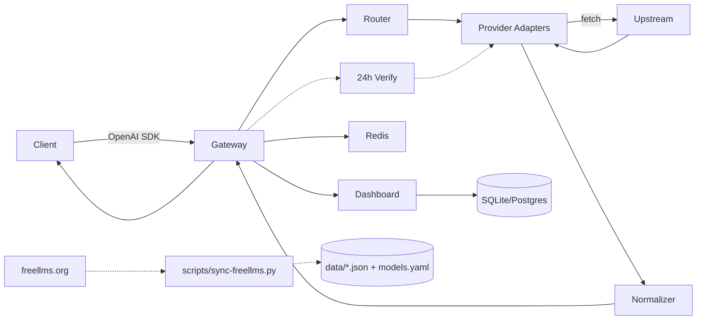

> **English** | [🇻🇳 Tiếng Việt](../vi/ARCHITECTURE.md) | [Docs Index](../README.md)

# Architecture

This document describes the detailed architecture of `app-auto-llm-free` — a unified gateway for free LLMs (30 freellms + 13 aliases = 43 IDs, 324 models from freellms.org + aliases).

## 1. Overview



* **Gateway**: Hono app running on Bun/Node/Cloudflare Workers (WinterCG). Multi-runtime, ultrafast RegExpRouter.
* **Router**: Selects the provider pool based on `model`, alias (`auto`, `gpt-4`, `glm`, `qwen`, `code`, `embedding`, `kilo-auto`), `x-router` header, 4-tier freellms fallback, and sanitizes `gemini 3.6 flash`/`nvidia: nemotron` (`openai-compatible.ts:31`).
* **Adapters**: Each provider implements the `Provider` interface. 43 IDs (30 freellms — NVIDIA 97, ModelScope 43, Cloudflare 35... + 13 aliases) via `createOpenAICompatibleProvider`, Gemini `gemini-3.6-flash` (`gemini.ts:5`), and scraped Pollinations. `nvidia-nim auto: nvidia/nemotron-3-ultra-550b-a55b` (410 fix applied).
* **Dashboard**: Vite + React (recharts), 5 routes `Dashboard→Providers→Models→Keys→Logs` (2-row header: `30 providers • 316 free` + Master on row 1, centered nav on row 2), `Dashboard` with 4 cards + 3 charts + tokens, `Models` with sticky bottom pagination 25/50 + checkbox (disabled for 404/410) + `Check Live` + `Used/Limit` + persisted strikethrough, `Providers` with pagination 25/50 + `Get Key ↗` + health, `Keys` with Generator + CRUD `fgk-...`, `Logs` with charts + SSE.
* **Data Layer**: `data/freellms-providers.json` (30), `data/freellms-models-free.json` (316), `models.yaml` (316), `data/verified-models.json` (live verify), `data/model-health.json` (persisted 404/410 strikethrough), `data/request-log.json` (1000 logs), `lib/paths.ts` resolves `data/` for both `cwd=root` and `cwd=apps/gateway`.
* **Scheduler**: `jobs/scheduler.ts` runs every 24h (`SYNC_INTERVAL_MS`), comparing freellms FREE vs live `/models` + `jobs/probe-models.ts` per-model chat probe (`/api/models/health` + persisted).
* **Token**: `lib/token-estimator.ts` uses char/4, `lib/request-log.ts` aggregates `allTimeTokens` + `tokensByProvider` for Dashboard/Logs charts.

References: `free-llm-gateway` (24+ providers) and `OmniRoute` (271 providers, 90 free).

## 2. Request Flow

```
1. POST /v1/chat/completions  {model, messages, stream, tools}
2. middleware/auth            -> verify `fgk-...` timing-safe, load scopes
3. middleware/rateLimit       -> Redis rolling window RPM/TPM check
4. token-estimator            -> estimate TPM pre-flight, reject if exceeded
5. smart-router               -> resolve alias (auto/gpt-4/glm/qwen) -> ordered provider pool
                                filter deprecated if verified data exists (verified=free)
6. for provider in pool:
      key = key-manager.getNext(provider)  # round-robin, skip rate-limited
      try: response = provider.chat(req, key) # fetch with proxy helper
      catch 429/timeout: quota-tracker.markRateLimited(key); continue
      catch other: circuit-breaker.recordFail(provider); continue
      success: break
7. normalizer                 -> convert Gemini shape to OpenAI shape
8. SSE passthrough            -> if stream: proxy chunk-by-chunk, handle mid-stream error
9. logger + request_db        -> record latency, tokens, cost, provider used
10. return OpenAI JSON/SSE
```

## 3. Provider Interface

`apps/gateway/src/providers/base.ts:1`

```ts
export interface ChatRequest {
  model: string;
  messages: Array<{ role: string; content: string | Part[] }>;
  temperature?: number;
  max_tokens?: number;
  stream?: boolean;
  tools?: Tool[];
  tool_choice?: string | object;
}

export interface Provider {
  id: string; // 'nvidia-nim' | 'groq' | 'google-gemini' | 'pollinations'
  type: 'openai-compatible' | 'gemini' | 'anthropic' | 'scraped';
  chat(req: ChatRequest, apiKey: string): Promise<Response>;
  models(apiKey?: string): Promise<ModelInfo[]>; // GET {baseUrl}/models
  health(apiKey: string): Promise<boolean>;
}
```

* `openai-compatible` (28/30): NVIDIA (`integrate.api.nvidia.com/v1`), Groq (`api.groq.com/openai/v1`), Cerebras, GitHub Models (`models.github.ai/inference`), OVH, Cohere (`/v2`), ModelScope, Chutes, SambaNova, SiliconFlow, Glhf, Mistral, LLM7, Agnes, Aion, Z AI (`open.bigmodel.cn/api/paas/v4`), DeepSeek, OpenRouter, Ollama Cloud, Nscale, Nebius, AI21… — only `baseURL + Authorization` required.
* `gemini`: Google (`generativelanguage.googleapis.com/v1beta`) — requires `format-translator` (OpenAI → Gemini contents).
* `scraped`: Pollinations (`text.pollinations.ai/openai`) — no key required, auto-maps alias `auto` → `openai`.

Registry `apps/gateway/src/providers/registry.ts:1` lists 43 IDs (30 freellms slugs + 13 aliases `mistral`/`gemini`/`nvidia`/`kilo-code`/`openrouter`), `providerMeta` contains caps/tier/noCard, and the alias map has 15+ keys (`kilo-auto`, `gemini-3.6`...).

## 4. Router & Fallback

Based on `smart_router.py` + OmniRoute's 19 strategies; actual freellms tiers:

| Strategy | Description |
|----------|-------------|
| `round-robin` | Default, distributes load |
| `tiered` | 4-tier from `.env.example:19` `FALLBACK_TIERS=[["nvidia-nim","groq","cerebras","google-gemini"],["cloudflare-workers-ai","cohere","sambanova","siliconflow"],["ovhcloud-ai-endpoints","modelscope","llm7-io","hugging-face"],["openrouter","kilo-code","pollinations"]]` |
| `latency` | Picks lowest p50 (P3) |
| `alias` | `auto`→5 P0, `gpt-4`→5, `claude-3`→4, `glm`→3, `qwen`→4, `code`→4, `embedding`→3 (see `registry.ts:42`) |
| `verified` | If `data/verified-models.json` + `data/model-health.json` (persisted 404/410) exist, `GET /v1/models?verified=free` excludes `deprecated` from the pool |

Fallback: Tiered fallback with circuit breaker (5 failures / 30s cooldown, `config.ts:30`). Mid-stream SSE error → emits `data: {"error": ...}\n\n` then closes. Persisted `model-health.json` is merged in `chat.ts:22` to skip `deprecated` even before `verify` runs.

## 5. Key Management & Security

* **Encryption at rest**: AES-256-GCM (WebCrypto), key derived from `ENCRYPTION_KEY`. Follows `key_encryptor.py` style.
* **Virtual keys**: `fgk-` prefix, SHA-256 hash, scopes `{models, providers}`, `rpmLimit`, `tpdLimit`.
* **Key pool**: `GROQ_API_KEYS=gsk_xxx,gsk_yyy` → round-robin, skips `Retry-After`. `config.ts:32` supports 30 freellms providers (including `OVHCLOUD_API_KEYS` alias).
* **Auth**: `hono/bearer-auth` + timing-safe compare, `admin`/`user` roles.

## 6. Rate Limiting & Quota

* **Redis rolling window**: RPM/RPD/TPM/TPD per virtual key + per provider key (freellms limits: NVIDIA 40 RPM shared, Groq 30/14.4K, Cerebras 15/1M TPD, Gemini 15/1.5K, OVH 2 anon, Agnes 30, OpenRouter 200/day, Kilo ~200/hr).
* **Headers**: `x-ratelimit-remaining-*`, `retry-after` on 429.
* **Token estimator**: `js-tiktoken` pre-flight. `quota-tracker.ts` (P3) will use the `limit` field from `models.yaml:1`.

## 7. Data & Verification

| File | Source | Contents |
|------|--------|----------|
| `data/freellms-providers.json` | freellms.org/providers (30) | `name, slug, tier, caps, noCard, free_models` |
| `data/freellms-models-free.json` | freellms.org/models (316 free) | `name, slug, context, score, limit, verified, modality` |
| `models.yaml` | `scripts/sync-freellms.py` | 316 entries, `id: nvidia-nim/z-ai/glm-5.2`, `score`, `limit` |
| `data/verified-models.json` | `jobs/verify-free.ts` live probe | `status: verified_free / deprecated / unverified_no_key / error`, `last_verified` |
| `data/verified-summary.json` | `jobs/verify-free.ts` | Per-provider summary |

Sync flow: `scripts/sync-freellms.py` (Layer 1) → `jobs/verify-free.ts` probes `provider.models()` every 24h (Layer 2, scheduler + `POST /api/verify`) → `GET /v1/models?verified=free` returns only `verified_free`. See `docs/OPERATIONS.md:1`.

## 8. Database & Files

Drizzle ORM (`apps/gateway/src/db/schema.ts:1`):

```ts
users(id, email, password_hash, role)
virtual_keys(id, prefix, hash, user_id, scopes JSON, rpm_limit, tpd_limit)
provider_keys(id, provider, encrypted_key, status, last_checked_at)
requests(id, virtual_key_id, provider, model, prompt_tokens, completion_tokens, latency, cost, status, created_at)
providers_cache(provider, models JSON, synced_at)
```

* SQLite for dev, Postgres for prod, BRIN index. Runtime `data/virtual-keys.json` (hash), `data/request-log.json` (1000), `resolveDataPath` for both cwd cases.

## 9. Directory Structure

```
.
├── apps/gateway/src/
│   ├── index.ts              # serve + startScheduler()
│   ├── app.ts                # Hono + secureHeaders + cors + auth + virtualKeyRateLimit
│   ├── config.ts             # 30 providers keys + 4-tier fallback + SYNC_INTERVAL_MS
│   ├── lib/paths.ts          # resolveDataPath (fix 7 vs 316 bug)
│   ├── lib/key-manager.ts    # AES-GCM + round-robin + markRateLimited
│   ├── lib/quota-tracker.ts  # FREELLMS_LIMITS RPM/TPM
│   ├── lib/circuit-breaker.ts# 5/30s half-open
│   ├── lib/token-estimator.ts# char/4
│   ├── lib/virtual-keys.ts   # fgk- CRUD + hasScope
│   ├── lib/request-log.ts    # 1000 logs + tokens aggregation
│   ├── lib/otel.ts           # GenAI OTel
│   ├── lib/gemini-stream.ts  # Gemini SSE → OpenAI
│   ├── providers/registry.ts # 40 ids, providerMeta, auto 15-tier (real key → public)
│   ├── jobs/verify-free.ts   # freellms vs live /models
│   ├── jobs/probe-models.ts  # chat probe per-model usable
│   ├── jobs/scheduler.ts     # 24h
│   ├── routes/v1/models.ts   # freellms 316 + checkbox + Used/Limit + pollinations fallback
│   ├── routes/v1/chat.ts     # quota/breaker/verified/log + X-Verified
│   └── routes/api.ts         # /providers/health live, /models/health, /verify, /keys, /logs/stream, /stats
├── apps/web/src/
│   ├── main.tsx              # sticky nav Dashboard→Providers→Models→Keys→Logs
│   ├── pages/Dashboard.tsx   # 4 cards + 3 charts + tokens
│   ├── pages/Providers.tsx   # Get Key ↗ + health
│   ├── pages/Models.tsx      # checkbox + single Check Live + Used/Limit
│   ├── pages/Keys.tsx        # Key Generator + CRUD + Quick Test
│   ├── pages/Logs.tsx        # charts + SSE
│   ├── lib/getKeyUrls.ts     # 30 console URLs
│   └── index.css             # unified card/button/table (nav style)
├── data/*.json               # freellms + verified + benchmark
├── models.yaml               # 316 free
├── scripts/sync-freellms.py, benchmark.ts, rotate-keys.ts
└── .github/workflows/sync-freellms.yml # daily 02:00 UTC
```

## 10. Observability & Deploy

* `pino` pretty in dev / JSON in prod, GenAI OTel (`lib/otel.ts`), `secureHeaders`, `bodyLimit` 10MB.
* `GET /api/stats` — `allTimeTokens`, `tokensByProvider`, `avgTokens` + `GET /api/verify/summary` + `GET /api/models/health` chat probe.
* Docker prod non-root + HEALTHCHECK, Wrangler `wrangler.jsonc` for Cloudflare. See `docs/DEPLOYMENT.md:1`.
