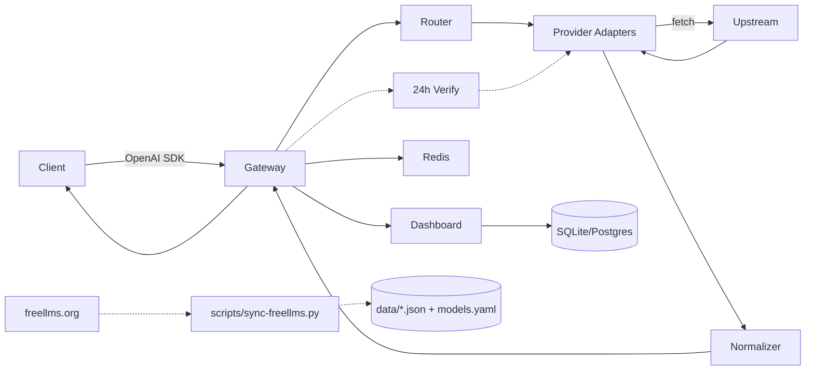

# Kiến trúc (Architecture)

Tài liệu này mô tả kiến trúc chi tiết của `app-auto-llm-free` — gateway thống nhất cho LLM free (30 freellms + 11 alias = 41 ids, 324 models từ freellms.org + alias).

## 1. Tổng quan



* **Gateway**: Hono app chạy trên Bun/Node/Cloudflare Workers (WinterCG). Multi-runtime, ultrafast RegExpRouter.
* **Router**: Chọn provider pool dựa trên `model`, alias (`auto`, `gpt-4`, `glm`, `qwen`, `code`, `embedding`, `kilo-auto`), header `x-router`, tier fallback 4-tier freellms, sanitize `gemini 3.6 flash`/`nvidia: nemotron` (`openai-compatible.ts:31`).
* **Adapters**: Mỗi provider implement `Provider` interface. 41 ids (30 freellms NVIDIA 97, ModelScope 43, Cloudflare 35... + 11 alias) qua `createOpenAICompatibleProvider`, Gemini `gemini-3.6-flash` (`gemini.ts:5`), Pollinations scraped. `nvidia-nim auto: nvidia/nemotron-3-ultra-550b-a55b` (đã fix 410).
* **Dashboard**: Vite + React (recharts), 5 routes `Dashboard→Providers→Models→Keys→Logs` (header 2 hàng `max-w-[1440px]` + Master **input chỉnh sửa** hàng 1 (password/text toggle, auto-fill từ `GET /api/bootstrap`), nav giữa hàng 2), `Dashboard` 4 cards + 3 charts + tokens, `Models` **filter bar 1 hàng**: `q` + `provider` + `verified` + **Filters** dropdown (4 toggles `hasKey` **mặc định tắt** + `hide404`/`Hide credits`/`Hide invalid ID` mặc định bật) + **top-right 3 nút** `Check Live (n)`/`Sync Live Now`/`Refresh` (`Refresh` reset `hasKeyOnly:false`, `Check` yêu cầu filter `q`/`provider`), pagination 25/50 sticky bottom + checkbox (`isRowDisabled` ưu tiên `live usable 200`/`usage>0` trước `deprecated`/`404/410`) + `Used/Limit` + strikethrough persist (`200 usable` giữ không đỏ sau reload), `Providers` pagination 25/50 + `Get Key ↗` + health + **Sync Live Now** (chung `POST /api/models/live/sync`), `Keys` Generator (collapsed) + CRUD `fgk-...`, `Logs` charts + SSE.
* **Data Layer**: `data/freellms-providers.json` (30), `data/freellms-models-free.json` (316), `models.yaml` (316), `data/verified-models.json` (live verify), `data/model-health.json` (persisted `404/410` + `200 usable` — `POST /api/models/health/mark` `200` override `404`, `GET /v1/models` `verified_free` sau `Check`), `data/live-models.json` (live sync 882 free, `POST /api/models/live/sync {freeOnly:true}` ở cả 2 pages), `data/request-log.json` (1000 logs), `lib/paths.ts` resolve `data/` cho cả `cwd=root` và `cwd=apps/gateway`.
* **Scheduler**: `jobs/scheduler.ts` 24h (`SYNC_INTERVAL_MS`), so sánh freellms FREE vs live `/models` + `jobs/probe-models.ts` chat probe per-model (`/api/models/health` `usable/402/404/410`) + `jobs/sync-live-models.ts` live sync 882 free. Đổi `.env` phải **restart gateway** `config.ts:22` mới nạp `hasRealKey`.
* **Token**: `lib/token-estimator.ts` char/4, `lib/request-log.ts` aggregation `allTimeTokens` + `tokensByProvider` cho Dashboard/Logs charts.

Tham khảo: `free-llm-gateway` (24+ providers) và `OmniRoute` (271 providers, 90 free).

## 2. Luồng request

```
1. POST /v1/chat/completions  {model, messages, stream, tools}
2. middleware/auth            -> verify `fgk-...` timing-safe, load scopes
3. middleware/rateLimit       -> Redis rolling window RPM/TPM check
4. token-estimator            -> ước tính TPM pre-flight, reject nếu vượt
5. smart-router               -> resolve alias (auto/gpt-4/glm/qwen) -> provider pool ordered
                               filter deprecated nếu có verified data (verified=free)
6. for provider in pool:
     key = key-manager.getNext(provider)  # round-robin, skip rate-limited
     try: response = provider.chat(req, key) # fetch với proxy helper
     catch 429/timeout: quota-tracker.markRateLimited(key); continue
     catch other: circuit-breaker.recordFail(provider); continue
     success: break
7. normalizer                 -> chuyển Gemini shape về OpenAI shape
8. SSE passthrough            -> if stream: proxy chunk-by-chunk, handle mid-stream error
9. logger + request_db        -> ghi latency, tokens, cost, provider đã dùng
10. return OpenAI JSON/SSE
```

## 3. Provider Interface

`apps/gateway/src/providers/base.ts:1`

```ts
export interface ChatRequest {
  model: string;
  messages: Array<{ role: string; content: string | Part[] }>;
  temperature?: number;
  max_tokens?: number;
  stream?: boolean;
  tools?: Tool[];
  tool_choice?: string | object;
}

export interface Provider {
  id: string; // 'nvidia-nim' | 'groq' | 'google-gemini' | 'pollinations'
  type: 'openai-compatible' | 'gemini' | 'anthropic' | 'scraped';
  chat(req: ChatRequest, apiKey: string): Promise<Response>;
  models(apiKey?: string): Promise<ModelInfo[]>; // GET {baseUrl}/models
  health(apiKey: string): Promise<boolean>;
}
```

* `openai-compatible` (28/30): NVIDIA (`integrate.api.nvidia.com/v1`), Groq (`api.groq.com/openai/v1`), Cerebras, GitHub Models (`models.github.ai/inference`), OVH, Cohere (`/v2`), ModelScope, Chutes, SambaNova, SiliconFlow, Glhf, Mistral, LLM7, Agnes, Aion, Z AI (`open.bigmodel.cn/api/paas/v4`), DeepSeek, OpenRouter, Ollama Cloud, Nscale, Nebius, AI21… — chỉ cần `baseURL + Authorization`.
* `gemini`: Google (`generativelanguage.googleapis.com/v1beta`) — cần `format-translator` (OpenAI → Gemini contents).
* `scraped`: Pollinations (`text.pollinations.ai/openai`) — không cần key, tự map alias `auto` → `openai`.

Registry `apps/gateway/src/providers/registry.ts:1` liệt kê 41 ids (30 freellms slugs + 11 alias `mistral`/`gemini`/`nvidia`/`kilo-code`/`openrouter`), `providerMeta` chứa caps/tier/noCard, alias map 15+ keys (`kilo-auto`, `gemini-3.6`...).

## 4. Router & Fallback

Học `smart_router.py` + OmniRoute 19 strategies, thực tế freellms tier:

| Strategy | Mô tả |
|----------|-------|
| `round-robin` | Mặc định, phân tán tải |
| `tiered` | 4-tier từ `.env.example:19` `FALLBACK_TIERS=[["nvidia-nim","groq","cerebras","google-gemini"],["cloudflare-workers-ai","cohere","sambanova","siliconflow"],["ovhcloud-ai-endpoints","modelscope","llm7-io","hugging-face"],["openrouter","kilo-code","pollinations"]]` |
| `latency` | Chọn p50 thấp nhất (P3) |
| `alias` | `auto`→5 P0, `gpt-4`→5, `claude-3`→4, `glm`→3, `qwen`→4, `code`→4, `embedding`→3 (xem `registry.ts:42`) |
| `verified` | Nếu có `data/verified-models.json` + `data/model-health.json` (persisted 404/410), `GET /v1/models?verified=free` loại `deprecated` khỏi pool |

Fallback: Tiered fallback với circuit breaker (5 fails / 30s cooldown, `config.ts:30`). Mid-stream SSE error → emit `data: {"error": ...}\n\n` rồi close. Persisted `model-health.json` được `chat.ts:22` merge để skip `deprecated` ngay cả khi chưa `verify`.

## 5. Key Management & Security

* **Encryption at rest**: AES-256-GCM (WebCrypto), key từ `ENCRYPTION_KEY` — **tự sinh** 64 hex nếu thiếu/placeholder (`config.ts:32`), persist `.env` hoặc `data/.gateway-keys.json`, không dùng làm API key.
* **Master key (single-key)**: `MASTER_KEY=fgk-master-...` — **1 key duy nhất** cho `/v1/*` + `/api/*` admin, tự sinh nếu thiếu và seed `vk-master` (`lib/virtual-keys.ts:116`). `fgk-...` scoped là tùy chọn per-app.
* **Virtual keys**: prefix `fgk-`, hash SHA-256, scopes `{models, providers}`, `rpmLimit`, `tpdLimit`.
* **Key pool**: `GROQ_API_KEYS=gsk_xxx,gsk_yyy` → round-robin, skip `Retry-After`. `config.ts:32` hỗ trợ 30 providers freellms (kể cả `OVHCLOUD_API_KEYS` alias).
* **Auth**: `hono/bearer-auth` + timing-safe compare, `admin`/`user`.

## 6. Rate Limiting & Quota

* **Redis rolling window**: RPM/RPD/TPM/TPD per virtual key + per provider key (freellms limits: NVIDIA 40 RPM shared, Groq 30/14.4K, Cerebras 15/1M TPD, Gemini 15/1.5K, OVH 2 anon, Agnes 30, OpenRouter 200/day, Kilo ~200/hr).
* **Headers**: `x-ratelimit-remaining-*`, `retry-after` khi 429.
* **Token estimator**: `js-tiktoken` pre-flight. `quota-tracker.ts` (P3) sẽ dùng `models.yaml:1` `limit` field.

## 7. Data & Verification

| File | Nguồn | Nội dung |
|------|-------|----------|
| `data/freellms-providers.json` | freellms.org/providers (30) | `name, slug, tier, caps, noCard, free_models` |
| `data/freellms-models-free.json` | freellms.org/models (316 free) | `name, slug, context, score, limit, verified, modality` |
| `models.yaml` | `scripts/sync-freellms.py` | 316 entries, `id: nvidia-nim/z-ai/glm-5.2`, `score`, `limit` |
| `data/verified-models.json` | `jobs/verify-free.ts` live probe | `status: verified_free / deprecated / unverified_no_key / error`, `last_verified` |
| `data/verified-summary.json` | `jobs/verify-free.ts` | Tổng hợp per-provider |

Luồng sync: `scripts/sync-freellms.py` (Layer 1) → `jobs/verify-free.ts` probe `provider.models()` mỗi 24h (Layer 2, scheduler + `POST /api/verify`) → `GET /v1/models?verified=free` chỉ trả `verified_free` + `?provider=` exact filter (frontend `provider` datalist 20). Xem `docs/OPERATIONS.md:1`.

## 8. Database & Files

Drizzle ORM (`apps/gateway/src/db/schema.ts:1`):

```ts
users(id, email, password_hash, role)
virtual_keys(id, prefix, hash, user_id, scopes JSON, rpm_limit, tpd_limit)
provider_keys(id, provider, encrypted_key, status, last_checked_at)
requests(id, virtual_key_id, provider, model, prompt_tokens, completion_tokens, latency, cost, status, created_at)
providers_cache(provider, models JSON, synced_at)
```

* SQLite dev, Postgres prod, BRIN index. Runtime `data/virtual-keys.json` (hash), `data/request-log.json` (1000), `resolveDataPath` cho cả cwd.

## 9. Cấu trúc thư mục

```
.
├── apps/gateway/src/
│   ├── index.ts              # serve + startScheduler()
│   ├── app.ts                # Hono + secureHeaders + cors + auth + virtualKeyRateLimit
│   ├── config.ts             # 30 providers keys + 4-tier fallback + SYNC_INTERVAL_MS
│   ├── lib/paths.ts          # resolveDataPath (fix 7 vs 316 bug)
│   ├── lib/key-manager.ts    # AES-GCM + round-robin + markRateLimited
│   ├── lib/quota-tracker.ts  # FREELLMS_LIMITS RPM/TPM
│   ├── lib/circuit-breaker.ts# 5/30s half-open
│   ├── lib/token-estimator.ts# char/4
│   ├── lib/virtual-keys.ts   # fgk- CRUD + hasScope
│   ├── lib/request-log.ts    # 1000 logs + tokens aggregation
│   ├── lib/otel.ts           # GenAI OTel
│   ├── lib/gemini-stream.ts  # Gemini SSE → OpenAI
│   ├── providers/registry.ts # 40 ids, providerMeta, auto 15-tier (real key → public)
│   ├── jobs/verify-free.ts   # freellms vs live /models
│   ├── jobs/probe-models.ts  # chat probe per-model usable
│   ├── jobs/scheduler.ts     # 24h
│   ├── routes/v1/models.ts   # freellms 316 + checkbox + Used/Limit + pollinations fallback
│   ├── routes/v1/chat.ts     # quota/breaker/verified/log + X-Verified
│   └── routes/api.ts         # /providers/health live, /models/health, /verify, /keys, /logs/stream, /stats
├── apps/web/src/
│   ├── main.tsx              # sticky nav Dashboard→Providers→Models→Keys→Logs
│   ├── pages/Dashboard.tsx   # 4 cards + 3 charts + tokens
│   ├── pages/Providers.tsx   # Get Key ↗ + health
│   ├── pages/Models.tsx      # checkbox + single Check Live + Used/Limit
│   ├── pages/Keys.tsx        # Key Generator + CRUD + Quick Test
│   ├── pages/Logs.tsx        # charts + SSE
│   ├── lib/getKeyUrls.ts     # 30 console URLs
│   └── index.css             # unified card/button/table (nav style)
├── data/*.json               # freellms + verified + benchmark
├── models.yaml               # 316 free
├── scripts/sync-freellms.py, benchmark.ts, rotate-keys.ts
└── .github/workflows/sync-freellms.yml # daily 02:00 UTC
```

## 10. Observability & Deploy

* `pino` pretty dev / JSON prod, OTel GenAI (`lib/otel.ts`), `secureHeaders`, `bodyLimit` 10MB.
* `GET /api/stats` — `allTimeTokens`, `tokensByProvider`, `avgTokens` + `GET /api/verify/summary` + `GET /api/models/health` chat probe.
* Docker prod non-root + HEALTHCHECK, Wrangler `wrangler.jsonc` Cloudflare. Xem `docs/DEPLOYMENT.md:1`.
